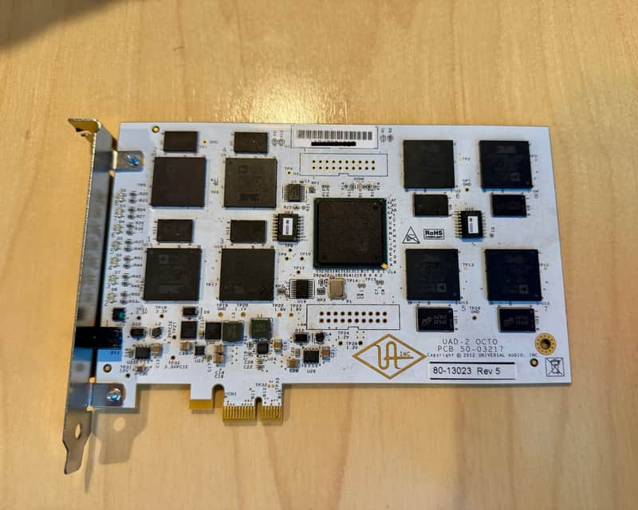

# UAD-2 OCTO reverse engineering

[](https://github.com/ahmadexp/uad2-octo-reverse-engineering/actions/workflows/ci.yml)
[](LICENSE)



An experimental, evidence-driven effort to understand the Universal Audio
UAD-2 PCIe OCTO host protocol and evaluate whether its eight SHARC DSPs can be
used for general-purpose computation.

> [!WARNING]
> This project performs low-level PCIe, MMIO, DMA, interrupt, and reset
> experiments on physical hardware. It is not a production driver. Running an
> experiment on a different board revision or without an isolated IOMMU group
> can crash the host, corrupt memory, or damage the card.

## Current result

The PCIe transport is now reproduced across all eight DSPs on one UAD-2 OCTO
Rev 5 card. All 16 four-page rings can be published through 64 IOMMU-contained
pages, every DSP engine can be enabled, official connect and query commands are
dequeued, and explicit cleanup plus VFIO reset recovers the cold state.

General-purpose DSP execution is **not yet achieved**. The queries receive no
reply because the card appears to be in a boot/framework state without the
runtime service expected by those commands. The exact matching official OCTO
firmware-update container has been identified. One bounded submission consumed
the extended command header but stopped before consuming its first data
descriptor, with no response or persistent-state evidence. The updater requires
a restart after PCIe firmware updates, so further submission is paused. The
ordinary `Bill` resource envelope, host transform, all four allocator pools,
and 87 official resource instances are recovered, but their DSP-side payloads
remain opaque. The next milestone is a valid runtime response followed by a
target-specific harmless program.

| Area | Status | Evidence |
|---|---|---|
| PCI identity and 64 KiB BAR | Confirmed | [`docs/hardware-profile.md`](docs/hardware-profile.md) |
| Eight DSP-ready locations | Confirmed | [`docs/dsp-status-2026-08-04.json`](docs/dsp-status-2026-08-04.json) |
| VFIO Type 1 IOMMU containment | Confirmed | [`docs/vfio-2026-08-04.json`](docs/vfio-2026-08-04.json) |
| Ring descriptors and index registers | Confirmed | [`docs/protocol-notes.md`](docs/protocol-notes.md) |
| DSP0 DMA and endpoint reset | Confirmed | Experiments 002 and 003 |
| Complete all-eight ring/DMA startup | Confirmed | [`docs/experiment-013-full-octo-start.md`](docs/experiment-013-full-octo-start.md) |
| Host command completion | Confirmed | [`docs/experiment-014-016-full-start-queries.md`](docs/experiment-014-016-full-start-queries.md) |
| Response delivery | Not yet observed | Experiments 014 through 016 |
| Official startup order | Recovered statically | [`docs/device-startup-sequence.md`](docs/device-startup-sequence.md) |
| Four-page DSP0 ring order | Confirmed with DMA disabled | [`docs/experiment-011-official-ring-initializer.md`](docs/experiment-011-official-ring-initializer.md) |
| Shared 4 MiB audio tables | Proven inapplicable to OCTO | [`docs/experiment-012-capability-and-audio-snapshot.md`](docs/experiment-012-capability-and-audio-snapshot.md) |
| DSP family and data-sheet map | Strong ADSP-21469 evidence | [`docs/dsp-model-and-memory-map.md`](docs/dsp-model-and-memory-map.md) |
| Exact matching firmware container | Header descriptor consumed, first data descriptor not consumed; potentially persistent | [`docs/experiment-021-runtime-load.md`](docs/experiment-021-runtime-load.md) |
| `Bill` DSP resource outer format and transform | Recovered statically | [`docs/bill-resource-analysis.md`](docs/bill-resource-analysis.md) |
| Four DSP resource pools and reservations | Confirmed across all eight DSPs | [`docs/experiment-020-resource-pools.md`](docs/experiment-020-resource-pools.md) |
| Official plug-in resource inventory | 87 instances, 69 unique hashes | [`docs/official-plugin-resource-inventory.md`](docs/official-plugin-resource-inventory.md) |
| Per-DSP reset isolation | Confirmed for all eight engines | [`docs/experiment-017-per-dsp-reset-isolation.md`](docs/experiment-017-per-dsp-reset-isolation.md) |
| DSP program loading | No executable program attempted | [`docs/roadmap.md`](docs/roadmap.md) |
| Generic compute API | Transport and status implemented; jobs gated | [`docs/driver-api.md`](docs/driver-api.md) |
| Kernel transport hardware run | Confirmed across all eight DSP engines | [`docs/experiment-019-kernel-transport.md`](docs/experiment-019-kernel-transport.md) |

## Observed hardware

- PCI address used during research: `0000:03:00.0`
- PCI ID: `1a00:0002`
- Subsystem ID: `1a00:0005`
- Class: `0480`, multimedia controller
- BAR0: 64 KiB
- Link: PCIe Gen1 x1
- FPGA revision: `0xa012dc0d`
- Extended capabilities: `0x00300811`
- Reported DSP count: 8
- IOMMU group during experiments: 16, containing only the card

The board serial is intentionally excluded. The 64 KiB endpoint differs from
older UAD-2 PCIe reports using device ID `0001` and a 16 KiB BAR. Do not run
these tools on an older profile.

## Repository guide

- [`docs/README.md`](docs/README.md): documentation and experiment index
- [`docs/hardware-profile.md`](docs/hardware-profile.md): confirmed hardware profile
- [`docs/protocol-notes.md`](docs/protocol-notes.md): ring, DMA, and interrupt model
- [`docs/experiment-methodology.md`](docs/experiment-methodology.md): safety and evidence rules
- [`docs/official-driver-static-analysis.md`](docs/official-driver-static-analysis.md): hash-locked driver findings
- [`docs/device-startup-sequence.md`](docs/device-startup-sequence.md): official device-start state machine
- [`docs/dsp-model-and-memory-map.md`](docs/dsp-model-and-memory-map.md): SHARC identification and address map
- [`docs/dsp-boot-and-reset-control.md`](docs/dsp-boot-and-reset-control.md): ready polling and per-engine reset bits
- [`docs/firmware-container-analysis.md`](docs/firmware-container-analysis.md): offline container and loader findings
- [`docs/bill-resource-analysis.md`](docs/bill-resource-analysis.md): DSP resource parser, transform, and allocator
- [`docs/official-plugin-resource-inventory.md`](docs/official-plugin-resource-inventory.md): official plug-in resource inventory
- [`docs/driver-api.md`](docs/driver-api.md): bounded kernel transport and userspace ABI
- [`docs/roadmap.md`](docs/roadmap.md): path toward a general-purpose compute stack
- [`tools/`](tools): passive capture, VFIO probes, and experiment wrappers
- [`kernel/`](kernel): read-only identity probe and bounded OCTO transport module
- [`lib/`](lib): userspace compute API and diagnostic client
- [`tests/`](tests): tests for allowlists and static-analysis tooling

## Safe starting point

Start with PCI configuration and sysfs metadata. This step does not enable,
bind, reset, map, or write to the endpoint:

```bash
python3 tools/capture_baseline.py \
  --host user@uad2-host \
  --bdf 0000:03:00.0
```

The first MMIO identity profile reads only six allowlisted words. Review
[`docs/experiment-methodology.md`](docs/experiment-methodology.md) before using
any remote wrapper. Set the SSH target explicitly for scripts that copy and
compile a probe:

```bash
export UAD2_TARGET=user@uad2-host
```

Do not begin with the query experiment. The query tool preserves a completed
negative experiment. Repeating service queries before a runtime is loaded is
not justified.

## Experiment history

1. Publish empty DSP0 ring descriptors and restore them.
2. Enable only the DSP0 DMA engine and restore cold reset.
3. Prove VFIO endpoint reset recovers the exact cold state.
4. Capture all 16 command and response ring windows.
5. Isolate ring `+0x20`, later identified as pending or notify index.
6. Isolate ring `+0x24`, later identified as host write index.
7. Activate an empty ring at index zero.
8. Publish one zero entry and observe hardware read-index advancement.
9. Submit two candidate framings of official query 026, with no response.
10. Repeat the corrected query with official DSP0 interrupt gates, with no
    response, then independently verify full recovery.
11. Publish four pages for both DSP0 rings in the official order with DMA
    disabled, then independently confirm all 256 ring words returned to zero.
12. Prove the optional 4 MiB audio path is absent on OCTO with a read-only BAR
    snapshot.
13. Reproduce the full empty startup across all eight DSPs and independently
    verify exact recovery.
14. Submit query 026 after full startup. Command consumed, no response.
15. Reproduce official connect commands, then query 026. All commands consumed,
    no response.
16. Reproduce connect commands, then query 027. All commands consumed, no
    response.
17. Pulse and recover each official per-DSP reset path independently with all
    rings empty and IOMMU-contained.
18. Submit two exact short-loader framings and a truncated HBUT header under
    bounded DMA. Every command was consumed without a reply, and every run
    recovered cleanly.
19. Bind the signed Linux transport module, publish all 64 coherent ring pages,
    exercise all eight per-DSP reset paths, stop, unload, and independently
    confirm exact cold-state recovery.
20. Snapshot all four allocator pools and scratch reservations for all eight
    DSPs through a read-only VFIO BAR mapping.
21. Submit the exact OCTO HBUT using the official large-block chain. The header
    descriptor was consumed, the first data descriptor was not, no response was
    written, and reset plus IOMMU teardown recovered the cold state.

Every experiment has a Markdown procedure and, where executed, a JSON result
under [`docs/`](docs). Experiment 008's original interpretation was revised:
read-index advancement is consistent with dequeue, but unchanged zero-filled
memory does not directly prove a DMA fetch.

## Reproducing the driver findings

No proprietary driver, firmware, or installer content is stored here. If you
legally possess the analyzed `UAD2Pcie.sys`, verify it locally:

```bash
python3 tools/inspect_official_driver.py /path/to/UAD2Pcie.sys
```

The verifier accepts only SHA-256
`20a11d5b51a4c5093f0c6c3cb80ba132959dcae3362547f4a41ea59f0dd99a6b`
and checks 45 instruction signatures supporting the documented ring, startup,
interrupt, DMA, DSP-ready, and query constants.

## Prior work

- [Open Apollo](https://github.com/rolotrealanis98/open-apollo), a GPL-2.0
  Linux driver and reverse-engineering project for related Apollo endpoints
- [stepbrobd/uad2](https://github.com/stepbrobd/uad2), an experimental Linux
  driver based on analysis of the macOS UAD PCIe driver

Their maps provided hypotheses, but this repository records observations and
restore behavior from the OCTO subsystem `1a00:0005` separately.

## Contributing and legal notes

Read [`CONTRIBUTING.md`](CONTRIBUTING.md) before proposing a register write or
hardware experiment. Report unsafe behavior privately as described in
[`SECURITY.md`](SECURITY.md).

Source code is licensed under GPL-2.0-only. Universal Audio, UAD, UAD-2, and
SHARC are trademarks of their respective owners. This independent research
project is not affiliated with or endorsed by Universal Audio or Analog
Devices.
