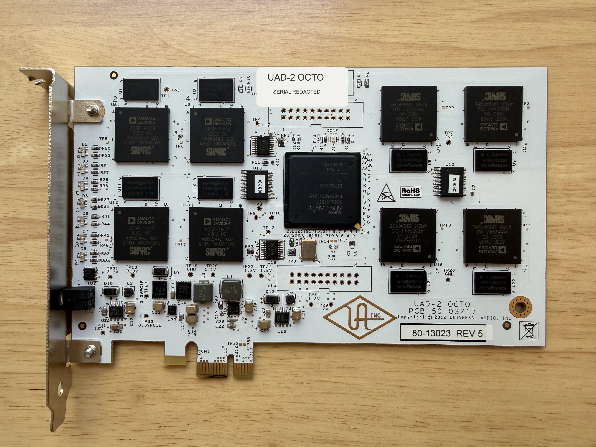

# Tested hardware profile

The repository targets one Universal Audio UAD-2 OCTO PCIe board marked
`UAD-2 OCTO PCB 50-03217`, assembly `80-13023 Rev 5`.

## Optical component identification

The 4032 by 3024 photograph resolves the major package markings on this exact
board. Identification is transcribed conservatively: unreadable manufacturing
codes are not reconstructed from likely catalog parts.

| Refdes and quantity | Legible top marking | Identification and confidence |
|---|---|---|
| `U3`, `U4`, `U5`, `U6`, `U15`, `U16`, `U17`, `U18` (8) | `ANALOG DEVICES`, `ADSP-21469`, `KBCZ-00`, `SHARC` | ADSP-21469 SHARC in the KBCZ package variant, optically confirmed on all eight packages |
| `U14` (1) | `XILINX`, `SPARTAN-6`, `XC6SLX75T`, `FGG676...`, `3C` | XC6SLX75T Spartan-6 FPGA in FGG676 package; the visible `3C` is consistent with a -3 commercial-grade device |
| `U1`, `U2`, `U8`, `U9`, `U11`, `U12`, `U21`, `U22` (8) | `NANYA`, `NT5TU64M16...` | Nanya NT5TU64M16-family DDR2 SDRAM, family confirmed but ordering suffix not reliably legible |

Analog Devices specifies the ADSP-21469 in a 324-ball CSP_BGA package with up
to a 450 MHz core and a 16-bit DDR2 interface. The package line visible here
does not independently establish whether these devices are the 400 MHz `-3`
or 450 MHz `-4` ordering variant. AMD's package documentation lists
XC6SLX75T in FGG676. These catalog specifications are not clock measurements
from the board. Primary references are the
[ADSP-21467/ADSP-21469 data sheet](https://www.analog.com/media/en/technical-documentation/data-sheets/ADSP-21467_21469.pdf),
[Spartan-6 packaging guide](https://docs.amd.com/v/u/en-US/ug385), and Nanya's
[NT5TU64M16 product-family page](https://www.nanya.com/en/Product/3783/NT5TU64M16HG-ACI).

## PCI endpoint

| Property | Observed value |
|---|---:|
| Vendor and device | `1a00:0002` |
| Subsystem vendor and device | `1a00:0005` |
| PCI class | `0480`, multimedia controller |
| Revision | `0x00` |
| BAR0 | 64 KiB memory window |
| Link | PCIe 2.5 GT/s x1 |
| FPGA revision | `0xa012dc0d` |
| Extended capabilities | `0x00300811` |
| Reported DSP count | 8 |
| Reported family field | 3 |

The passive capture found no bound driver, PCI memory decoding disabled, bus
mastering disabled, and the endpoint isolated in IOMMU group 16. Group numbers
and BDFs are host-specific and must not be assumed on another machine.

## DSP-ready profile

DSP0 reports `0x00000a03`; DSP1 through DSP7 each report `0x00000003`. Ready
bit zero is set and values were stable across repeated reads. Exact locations
are recorded in [`dsp-status-2026-08-04.json`](dsp-status-2026-08-04.json).

## Privacy and provenance

The board serial was observed but is not stored. The published photograph is a
metadata-stripped JPEG of the actual research card with a deterministic mask
confined to the serial-label area. Its source HEIC SHA-256 is
`5aebe0287939683d61c51daa0f2a8e930fd71d2de353ecc3a85621ac6f3c4456`; the
published JPEG SHA-256 is
`1ff6cb2651f636b01ab1c143779bc28b52c333b557c0b00e35c852717a39b45c`.
Captured host addressing is redacted because it is irrelevant to reproducing
the hardware findings.

## Compatibility boundary

Do not treat `1a00:0001` cards, 16 KiB BAR devices, other subsystem IDs, Apollo
interfaces, or Satellite units as interchangeable. Every mutating wrapper in
this repository checks the tested endpoint identity and expected IOMMU
isolation before binding VFIO.
